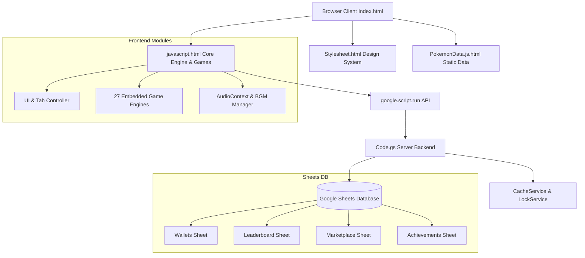
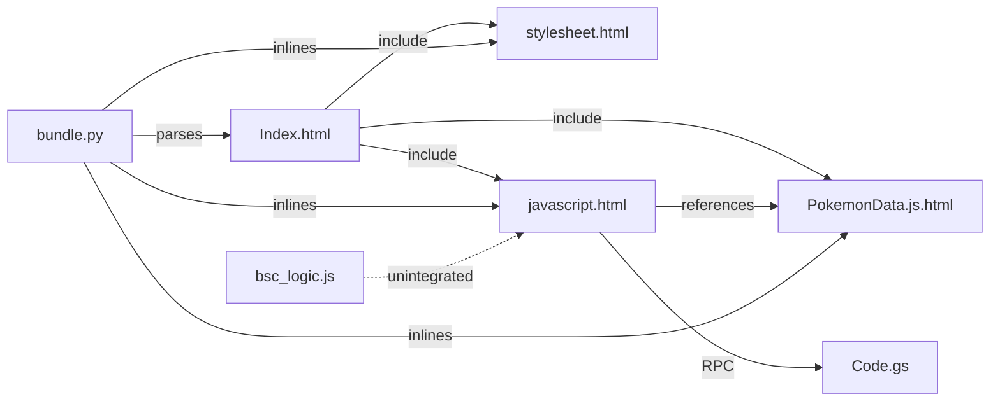

# Team Steven Arcade - Complete Architecture Inventory

## 1. Executive Summary & Overview

**Team Steven Arcade** is an enterprise gamification and arcade platform built on top of **Google Apps Script (GAS)** with **Google Sheets** serving as the relational persistence layer.

The system features:
- A responsive frontend UI implementing the "Next-Gen Glass" glassmorphism design system (`stylesheet.html`, `Index.html`).
- An active library of **27 embedded mini-games** spanning Canvas and DOM engines in `javascript.html`.
- RPG player progression (XP, levels, level-gated tabs, stat badges).
- A virtual marketplace (GTS / Rewards Store), Daily Bounties, Live Casino, and Leaderboards.
- Server-side anti-cheat verification, version locking (`APP_VERSION`), rate limiting, and concurreny management using `LockService`.

---

## 2. Per-File Architecture Inventory

### 2.1 `Code.gs`
- **Total Lines:** 1,977 lines | **Pure Code Lines:** 1,503 lines
- **Purpose:** Server-side Google Apps Script backend handling data persistence in Google Sheets, authentication/session management, rate limiting, RPG wallet/XP updates, game score validations, casino logic, GTS marketplace transactions, and admin operations.
- **Major Functions:** `doGet`, `getSpreadsheet_`, `_checkRateLimit`, `_log`, `getSessionInfo`, `startGame`, `updateWallet`, `purchaseItem`, `claimBountyReward`, `saveScore`, `getLeaderboard` (x2), `getGlobalRankings`, `getAllPersonalBests`, `saveAchievement`, `getProfileStats`, `saveFeedback`, `getWalletBalance`, `playCasino`, `getLiveJackpotWithVersion`, `clientConvertTicket`, `processGameRewards`, `getPerformanceMultiplier`, `calculateFatigue`, `verifyAdmin`, `executeAdminAction`, `getTeamRankings`, `updatePlayerProfile`, `getPokemonData`, `syncPokemonData`, `getGTSListings`, `placeGTSBid`, `createGTSListing`, `buyoutGTSListing`, `syncRankedDefense`, `getRankedMatch`, `resolveRankedMatch`, `resolveExpiredAuction`, `getArcadeLeaderboard`, `_currentMonthKey`, `updateMonthlyBest`, `getAvailableMonths`, `getMonthlyLeaderboard`, `purgeExploiters`, `getPvPLeaderboard`, `adminWipePokemonData`, `adminNuclearWipeArcade`.
- **Dependencies:** Google Apps Script Runtime (`SpreadsheetApp`, `LockService`, `CacheService`, `Session`, `HtmlService`).
- **Functions Called from Other Files:** Invoked via `google.script.run` from `javascript.html` (`saveScore`, `updateWallet`, `playCasino`, `getSessionInfo`, `getLeaderboard`, `purchaseItem`, `claimBountyReward`, etc.).
- **Functions Exposed Globally:** All non-underscored functions are globally exposed GAS web app entry points or RPC targets.
- **Data Flow Paths:**
  - Client (`javascript.html`) -> `google.script.run.saveScore(...)` -> `saveScore()` in `Code.gs` -> `SpreadsheetApp` (Wallets & Leaderboard Sheets) -> CacheService/LockService -> Return success JSON to Client.
  - Client (`javascript.html`) -> `google.script.run.playCasino(...)` -> `playCasino()` in `Code.gs` -> Server-side RNG & Validation -> Sheets update -> Return result to Client.

### 2.2 `javascript.html`
- **Total Lines:** 13,054 lines | **Pure Code Lines:** 11,142 lines
- **Purpose:** Core client-side JavaScript engine wrapped in `<script>` tags, handling application lifecycle, tab navigation, modal rendering, bento grid layout, sound/BGM audio management, local state management, keyboard listeners, carousel, babi code easter eggs, and 27 embedded game engines (canvas & DOM based).
- **Major Functions:** `showTab`, `enforceLevelGates`, `renderRow`, `renderFeatured`, `initBGM`, `playBGM`, `openGameModal`, `closeGameModal`, `submitScore`, `updateHeaderStats`, `openSettings` (x2), `saveSettings` (x2), `_buildCarouselSlides`, `renderHub`, `_step`, `drawBlock`, `init`, `loop`, `draw`, `update`.
- **Dependencies:** Browser APIs (`window`, `document`, `HTMLCanvasElement`, `AudioContext`, `localStorage`, `requestAnimationFrame`), Google Apps Script Client API (`google.script.run`).
- **Functions Called from Other Files:** Included into `Index.html` via `<?!= include('javascript'); ?>`.
- **Functions Exposed Globally:** Global variables (`GAMES`, `ARCADE`, `BRAIN`, `CASINO_GAMES`, `score`, `currentPlayerLevel`, `babiCode`, `confetti`), window-scoped functions (`showTab`, `openGameModal`, `submitScore`, etc.).
- **Data Flow Paths:**
  - User interaction -> Event Listener -> Game Loop/State Update -> Canvas/DOM Draw -> `submitScore()` -> `google.script.run.saveScore()` -> Dynamic UI update (`updateHeaderStats()`).

### 2.3 `Index.html`
- **Total Lines:** 744 lines | **Pure Code Lines:** 655 lines
- **Purpose:** Primary application HTML shell defining structural layout, global header with stat badges, navigation tabs (`role="tablist"`), game containers, modals, toast container, audio elements (`#bgmLobby`), and script/style inclusion.
- **Major Functions:** None (HTML structure file). Contains template script blocks and GAS `include()` calls.
- **Dependencies:** `stylesheet.html`, `javascript.html`, `PokemonData.js.html`.
- **Functions Called from Other Files:** Rendered by `doGet()` in `Code.gs`.
- **Functions Exposed Globally:** Global HTML DOM element IDs (`#globalFooter`, `#bgmLobby`, `#searchInput`, `#toastContainer`, `#soundBtn`, etc.).
- **Data Flow Paths:**
  - Entry point HTML template -> Script inclusions execute -> Binds to DOM IDs -> UI rendered.

### 2.4 `stylesheet.html`
- **Total Lines:** 1,434 lines | **Pure Code Lines:** 1,241 lines
- **Purpose:** Centralized CSS stylesheet wrapped in `<style>` tags implementing the "Next-Gen Glass" design system, responsive Bento grids, glassmorphism cards, accessibility focus states (`:focus-visible`), theme variables, game screen overlays (`z-index: 9000`), and modal styling.
- **Major Functions:** None (CSS declarations).
- **Dependencies:** Included into `Index.html` via `<?!= include('stylesheet'); ?>`.
- **Functions Called from Other Files:** Applied globally to `Index.html` DOM elements.
- **Functions Exposed Globally:** CSS Variables (`--primary`, `--bg-dark`, `--glass-bg`, etc.), class definitions (`.app-card`, `.feat-card`, `.game-screen`, `.tab-panel`).
- **Data Flow Paths:**
  - Dynamic class toggling in `javascript.html` -> CSS styles applied to HTML nodes in `Index.html`.

### 2.5 `PokemonData.js.html`
- **Total Lines:** 310 lines | **Pure Code Lines:** 287 lines
- **Purpose:** Data module containing static definitions for Pokemon mini-game moves (`POKEMON_MOVES`), evolutions (`POKEMON_EVOLUTIONS`), and base Pokedex data (`POKEDEX`).
- **Major Functions:** None (Static data structures).
- **Dependencies:** Included into `Index.html` via `<?!= include('PokemonData.js'); ?>`.
- **Functions Called from Other Files:** Referenced by `GAMES['Pokemon Play']` in `javascript.html`.
- **Functions Exposed Globally:** `POKEMON_MOVES`, `POKEMON_EVOLUTIONS`, `POKEDEX`.
- **Data Flow Paths:**
  - `PokemonData.js.html` defines global variables -> Read by `javascript.html` during `Pokemon Play` game loop and GTS marketplace queries.

### 2.6 `bsc_logic.js`
- **Total Lines:** 380 lines | **Pure Code Lines:** 350 lines
- **Purpose:** Standalone, unintegrated Battleship Command game engine logic utilizing a 12x12 grid, tactical abilities (Radar Scan, Sonar Ping, Barrage), and hunt/random AI modes.
- **Major Functions:** Object methods inside `'Battleship Command'`: `init`, `setupBoard`, `placeAiShips`, `handleCellClick`, `fireShot`, `triggerAbility`, `executeAiTurn`, `checkGameOver`.
- **Dependencies:** Pure JavaScript object structure, expects global `rawScore` variable and DOM grid elements.
- **Functions Called from Other Files:** None (Currently unreferenced/dead code candidate).
- **Functions Exposed Globally:** Exposes `'Battleship Command'` game object.
- **Data Flow Paths:**
  - Standalone file not currently connected to `Index.html` or `javascript.html`.

### 2.7 `bundle.py`
- **Total Lines:** 79 lines | **Pure Code Lines:** 68 lines
- **Purpose:** Python utility script for local testing and verification. Parses `Index.html`, resolves server-side GAS `include('filename')` directives by inlining `stylesheet.html`, `javascript.html`, and `PokemonData.js.html`, and outputs a standalone `bundled.html` file for Playwright testing.
- **Major Functions:** `include_replacer`, script execution body.
- **Dependencies:** Python 3 standard library (`re`, `os`, `sys`).
- **Functions Called from Other Files:** Executed via CLI (`python3 bundle.py`).
- **Functions Exposed Globally:** CLI script.
- **Data Flow Paths:**
  - Reads `Index.html`, `stylesheet.html`, `javascript.html`, `PokemonData.js.html` -> Merges contents -> Writes `bundled.html`.

---

## 3. Structural & Categorical Analysis

### 3.1 Large Functions (>100 Pure Code Lines)

1. **`renderHub` (`javascript.html`, L3791–L4355):** 489 pure code lines (565 total lines). Renders Pokemon Hub view, inventory, team, and GTS listings.
2. **`executeTurn` (`javascript.html`, L2793–L3176):** 336 pure code lines (384 total lines). Turn-based combat execution for Pokemon Play.
3. **`_step` (`javascript.html`, L9658–L10021):** 324 pure code lines (364 total lines). Game loop step for Sector Defense.
4. **`update` (`javascript.html`, L6043–L6279):** 213 pure code lines (237 total lines). PacMan ghost AI and collision update loop.
5. **`update` (`javascript.html`, L8320–L8517):** 173 pure code lines (198 total lines). Spam Defender wave spawning and tower targeting update loop.
6. **`draw` (`javascript.html`, L8518–L8713):** 168 pure code lines (196 total lines). Spam Defender canvas rendering.
7. **`_render` (`javascript.html`, L910–L1089):** 160 pure code lines (180 total lines). Pou virtual pet state rendering and action UI.
8. **`draw` (`javascript.html`, L10026–L10199):** 148 pure code lines (174 total lines). Sector Defense tower and enemy particle drawing.
9. **`draw` (`javascript.html`, L4958–L5164):** 144 pure code lines (207 total lines). Cafe Tycoon kitchen and customer state rendering.
10. **`handleKey` (`javascript.html`, L7127–L7284):** 134 pure code lines (158 total lines). 2048 tile movement and merging input handler.
11. **`_renderGTSListings` (`javascript.html`, L4411–L4563):** 131 pure code lines (153 total lines). GTS market card generator.
12. **`_bindPointerEvents` (`javascript.html`, L9368–L9516):** 132 pure code lines (149 total lines). Sector Defense touch and drag pointer handler.
13. **`draw` (`javascript.html`, L6362–L6522):** 129 pure code lines (161 total lines). Candy Crush board rendering.
14. **`update` (`javascript.html`, L10768–L10914):** 124 pure code lines (147 total lines). Flappy Bot particle physics and obstacle update.
15. **`_buildCarouselSlides` (`javascript.html`, L70–L205):** 121 pure code lines (136 total lines). Dynamic banner carousel slide builder.
16. **`draw` (`javascript.html`, L10966–L11116):** 122 pure code lines (151 total lines). Cosmic Merge planet rendering.
17. **`draw` (`javascript.html`, L6649–L6808):** 120 pure code lines (160 total lines). Tetris board, ghost piece, and wall-kick renderer.
18. **`saveScore` (`Code.gs`, L240–L390):** 116 pure code lines (151 total lines). GAS backend score verification, anti-exploit check, sheet row append, XP grant, and level ups.
19. **`playCasino` (`Code.gs`, L668–L815):** 106 pure code lines (148 total lines). Server-side casino spin/hand resolution, payout calculation, and jackpot pooling.
20. **`draw` (`javascript.html`, L7392–L7509):** 101 pure code lines (118 total lines). Minesweeper board drawing.

### 3.2 Duplicate Functions & Duplicate Business Logic
1. **Duplicate Function Name: `getLeaderboard` (`Code.gs`)**
   - Line 392: `function getLeaderboard(game, filter)`
   - Line 1577: `function getLeaderboard()` (Overrides previous implementation!)
2. **Duplicate Function Names: `openSettings` & `saveSettings` (`javascript.html`)**
   - Line 12048 & 12061: Modal-based settings handler.
   - Line 12949 & 12963: Duplicate settings modal handler at end of file.
3. **Duplicate Battleship Game Logic:**
   - `javascript.html` (L7512): Canvas-based Battleship implementation (10x10).
   - `bsc_logic.js` (L1): DOM-based Battleship Command implementation (12x12).
4. **Duplicate High Score / Leaderboard Parsing:**
   - Multiple functions in `Code.gs` (`getLeaderboard`, `getGlobalRankings`, `getArcadeLeaderboard`, `getMonthlyLeaderboard`, `getPvPLeaderboard`) duplicate sheet lookup and sort logic.

### 3.3 Global Variables Map
- **`Code.gs`:** `APP_VERSION`, `SPREADSHEET_ID`, `EXCHANGE_RATE`, `ACHIEVEMENT_DEFS`, `ADMIN_USERS`.
- **`javascript.html`:** `score`, `currentPlayerLevel`, `reqAnimFrame`, `canvas`, `confCanvas`, `domEngine`, `globalUserLdap`, `activeSecurityToken`, `drawsSinceLastPlay`, `currentCarouselIndex`, `carouselSlides`, `carouselInterval`, `currentBGM`, `lobbyPlaylist`, `currentLobbyTrack`, `activeThemeName`, `hasInteracted`, `sessionGamesCount`, `sessionStartTime`, `babiCode`, `babiPos`, `CLIENT_VERSION`, `audioCtx`, `konamiCode`, `konamiPos`, `HOW_TO`, `POKEMON_WEAKNESS`, `POKEDEX_MAP`, `Games`, `confetti`, `ARCADE`, `BRAIN`, `CURRENT_SEASON`, `NEW_GAMES`, `CASINO_GAMES`, `_searchDebounce`, `isPurchasing`, `modalCallback`, `GAME_BG`, `pixieCanvas`, `pixieCtx`, `pixies`.
- **`PokemonData.js.html`:** `POKEMON_MOVES`, `POKEMON_EVOLUTIONS`, `POKEDEX`.

### 3.4 Event Listeners
- **Global Window / Document Listeners (`javascript.html`):**
  - `DOMContentLoaded`: App initialization, BGM setup, theme check, level gate enforcement.
  - `keydown`: Roving tabindex navigation, '/' shortcut for search, Enter/Space button triggers, Konami & Babi cheat codes.
  - `keyup`: Game key release events.
  - `resize`: Canvas resizing, confetti repositioning.
  - `visibilitychange`: Audio auto-pause when tab backgrounded.
  - Pointer/Touch Listeners: `mousedown`, `mousemove`, `mouseup`, `touchstart`, `touchmove`, `touchend`, `contextmenu` (canvas drag/aiming in games like 8-Ball Pool, Sector Defense, Darts, Basketball).

### 3.5 Google Apps Script Entry Points
- `doGet(e)`: Main HTTP web app endpoint rendering `Index.html`.
- `saveScore(score, gameName, token)`: Remote RPC endpoint.
- `updateWallet(amount, action)`: Remote RPC endpoint.
- `playCasino(gameType, bet)`: Remote RPC endpoint.
- `getSessionInfo()`: Remote RPC endpoint.
- `getLeaderboard()`: Remote RPC endpoint.
- `purchaseItem(itemId)`: Remote RPC endpoint.
- `claimBountyReward(bountyId)`: Remote RPC endpoint.
- `executeAdminAction(action, payload)`: Admin RPC endpoint.

### 3.6 UI Modules
- Header Stat Badges (XP, Points, Tickets, CSAT).
- Tab Navigation Bar (Store Front, Puzzle & Strategy, Card & Casino, Rewards, Hall of Fame, Admin).
- Bento Grid Game Catalog (`renderRow`, `renderFeatured`).
- Carousel Banner Component (`_buildCarouselSlides`).
- Modal System (Game Container, Settings Modal, Feedback Modal, GTS Market Modal).
- Toast Alert System (`showToast`).

### 3.7 Game Modules (27 Active Games in `javascript.html`)
- **Arcade:** Pou, Basketball Hoops, Darts, 8-Ball Pool, Cafe Tycoon, Candy Run, PacMan, Flappy Bot, Cosmic Merge.
- **Puzzle & Brain:** Block Blast, Pokemon Play, Severity 1: Core Breach, Piano Tiles, Candy Crush, Tetris, Minesweeper, 2048, Battleship, Connect Four, Spam Defender, Sector Defense.
- **Casino & Card:** High-Roller Slots, Auto-Blackjack, Rigged Baccarat, Derby Racing.
- **Retired / Inactive in `GAMES` list:** Retro Snake, Sudoku.

### 3.8 Score & Operations Modules
- `Code.gs`: Anti-cheat verification (`MIN_DURATION_MS`, score ceiling checks), level progression formulas, XP grant calculations, monthly leaderboard archival, exploit purging (`purgeExploiters`).

### 3.9 Utility / Helper Modules
- `include(filename)` in `Code.gs`: Server-side file inclusion helper.
- `bundle.py`: Local Playwright test bundling helper.
- `showToast(msg, type)` in `javascript.html`: Client notification helper.
- Audio synthesis helpers (`playBeep`, AudioContext generators).

---

## 4. Architectural Diagrams & Maps

### 4.1 High-Level Architecture Diagram

#### Mermaid Format


#### ASCII Format
```
+-----------------------------------------------------------------------+
|                            BROWSER CLIENT                             |
|                               Index.html                              |
|   +-------------------+  +--------------------+  +----------------+   |
|   |  stylesheet.html  |  |  javascript.html   |  | PokemonData.js |   |
|   | (Next-Gen Glass)  |  | (27 Games & Logic) |  | (Static Data)  |   |
|   +-------------------+  +--------------------+  +----------------+   |
+------------------------------------+----------------------------------+
                                     | google.script.run (RPC)
                                     v
+-----------------------------------------------------------------------+
|                      GOOGLE APPS SCRIPT BACKEND                        |
|                               Code.gs                                 |
|       +-------------------+               +--------------------+      |
|       |  Auth & Anti-Cheat|               | Casino & RPG Engine|      |
|       +-------------------+               +--------------------+      |
|                 | CacheService / LockService        |                 |
+-----------------|-----------------------------------|-----------------+
                  v                                   v
+-----------------------------------------------------------------------+
|                        GOOGLE SHEETS DATABASE                         |
|   [Wallets]      [Leaderboard]      [Marketplace]     [Achievements]  |
+-----------------------------------------------------------------------+
```

### 4.2 File Dependency Map

#### Mermaid Format


#### ASCII Format
```
Index.html
  │
  ├──► stylesheet.html (Inlined via include)
  ├──► javascript.html (Inlined via include)
  │      │
  │      ├──► PokemonData.js.html (References POKEDEX & POKEMON_MOVES)
  │      └──► Code.gs (Invokes backend functions via google.script.run)
  │
  └──► PokemonData.js.html (Inlined via include)

bsc_logic.js (Standalone / Unreferenced Dead Code Candidate)

bundle.py
  ├──► Reads Index.html, stylesheet.html, javascript.html, PokemonData.js.html
  └──► Generates bundled.html for local testing
```

### 4.3 Global Variable Map

| Scope / File | Variable Name | Type / Purpose |
| :--- | :--- | :--- |
| `Code.gs` | `APP_VERSION` | String constant for client version lock |
| `Code.gs` | `SPREADSHEET_ID` | Google Sheet ID target |
| `Code.gs` | `EXCHANGE_RATE` | Point to ticket conversion rate |
| `Code.gs` | `ACHIEVEMENT_DEFS` | Object defining RPG achievements |
| `Code.gs` | `ADMIN_USERS` | Array of admin LDAP identifiers |
| `javascript.html` | `CLIENT_VERSION` | String constant matching `APP_VERSION` |
| `javascript.html` | `GAMES` / `ARCADE` | Core game objects registry |
| `javascript.html` | `score`, `currentPlayerLevel` | Active gameplay state variables |
| `javascript.html` | `babiCode`, `konamiCode` | Cheat code input tracking state |
| `javascript.html` | `lobbyPlaylist`, `currentBGM` | Audio playlist management state |
| `PokemonData.js.html` | `POKEMON_MOVES`, `POKEDEX` | Static lookup objects for Pokemon game |

---

## 5. Dead Code Candidates

1. **`bsc_logic.js` (Entire File - 380 Lines):** Standalone Battleship logic file not included or referenced anywhere in the runtime app.
2. **`getLeaderboard()` Duplicate in `Code.gs` (L1577):** The second definition of `getLeaderboard()` accepts no arguments and overrides the parameterized `getLeaderboard(game, filter)` at line 392.
3. **`openSettings()` / `saveSettings()` Duplicates in `javascript.html` (L12949, L12963):** Dead duplicate definitions at the bottom of the script file.
4. **Retired Games in `javascript.html`:** Code references for retired games (`Retro Snake`, `Sudoku`) remain in the codebase even though they are removed from active tab views.

---

## 6. Refactoring Opportunities Ranked by Impact

| Rank | Issue / Opportunity | Impact | Effort | Recommended Action |
| :---: | :--- | :---: | :---: | :--- |
| **1** | **Monolithic `javascript.html` (13k+ lines)** | Critical | High | Break into modular sub-files (`games/`, `ui/`, `audio/`, `core/`) and concatenate during GAS build or include step. |
| **2** | **Duplicate `getLeaderboard` in `Code.gs`** | High | Low | Remove the dead L1577 definition to eliminate function shadowing and RPC bug risks. |
| **3** | **Unused `bsc_logic.js` & Duplicate Battleship** | Medium | Low | Either integrate `bsc_logic.js` into `javascript.html` or remove `bsc_logic.js` from repository. |
| **4** | **Duplicate `openSettings` / `saveSettings`** | Medium | Low | Delete lines 12949–12965 in `javascript.html`. |
| **5** | **Extract Shared Score Verification Logic** | Medium | Medium | Centralize sheet querying, caching, and anti-exploit validations in `Code.gs` into reusable private helper functions. |

---

## 7. Recommended Future Folder Structure

```
Team-Steven-Arcade/
├── .Jules/                         # Jules memory & agent configuration
├── docs/                           # Documentation
│   └── ARCHITECTURE.md             # Architecture inventory & map
├── src/                            # Source code (modular)
│   ├── backend/
│   │   ├── Code.gs                 # Primary GAS entry points & router
│   │   ├── WalletService.gs        # Wallet, XP, and RPG logic
│   │   ├── LeaderboardService.gs   # Leaderboard queries & archival
│   │   ├── CasinoService.gs        # Casino spin & payout logic
│   │   └── AdminService.gs         # Admin RPC operations
│   ├── frontend/
│   │   ├── Index.html              # HTML Shell
│   │   ├── stylesheet.html         # Design System & Styles
│   │   ├── core/
│   │   │   ├── App.js.html         # Lifecycle & Initialization
│   │   │   ├── Navigation.js.html  # Tab Routing & Level Gating
│   │   │   └── Audio.js.html       # BGM & Sound Manager
│   │   ├── data/
│   │   │   └── PokemonData.js.html # Pokemon static data
│   │   └── games/                  # Individual game modules
│   │       ├── ArcadeGames.js.html
│   │       ├── PuzzleGames.js.html
│   │       ├── CardGames.js.html
│   │       └── BattleshipCommand.js.html
│   └── utils/
│       └── bundle.py               # Local Playwright test bundler
├── README.md                       # Project overview
└── ARCHITECTURE.md                 # Root architecture doc
```
